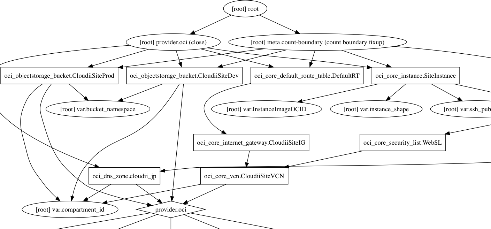
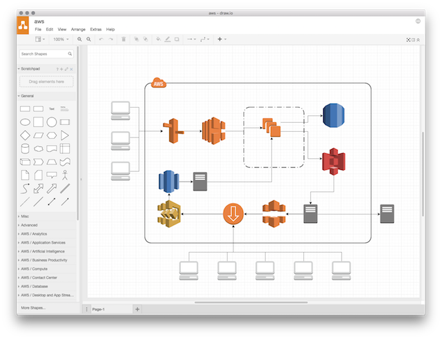
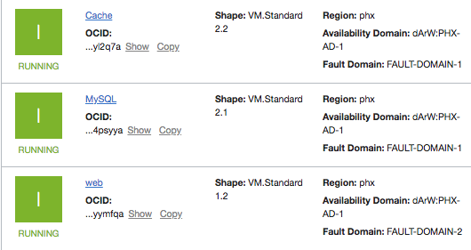
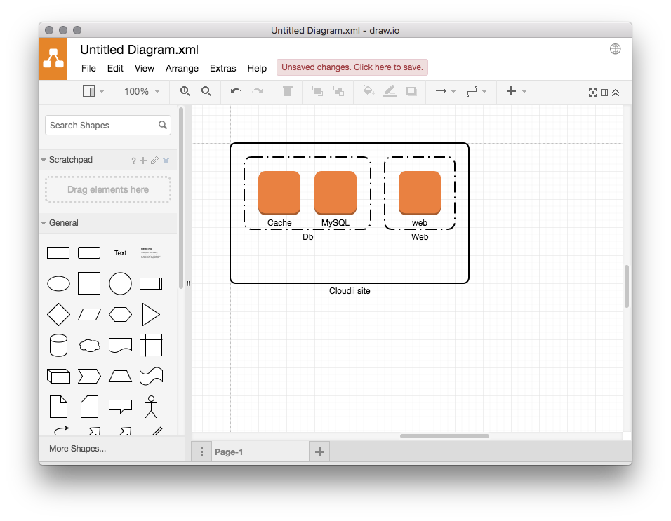

## AWSユーザが始める Oracle Cloud

### Oracle Cloud Friends#1

2018.11.08

---

# About me

* Daisuke Higashi
* Atomitech, Inc.
* Manager / Software Engineer
* Github, Twitter: lulichn

---

# Our works

#### ゲームのサーバサイドの開発・運用

* Java, Scala, PHP, etc...
* AWS

---

# AWS!

---

# AWS

## AWSを利用されている方?

---

# AWS

## 良いですよね

※ この発言は個人の見解であり、 所属する組織の公式見解ではありません

---

## Game Server Architecture

<!-- .element: style="float: right; width: 40%" -->

* API
    * ELB + EC2 + AutoScaling 
    * EKS
    * RDS
    * ElastiCache
* Assets
    * CloudFront + S3
* Log analysis
    * S3 + Athena (like Presto)
* Admin
    * Serverless: API Gateway + Lambda
    * Cognito

肩までずっぷり。ずぶずぶ。

<!-- .element: style="width: 60%" -->
<!-- .element: style="font-size:70%;"    -->

---

### エコシステム(?)

(利用してるもの)

---

## 構成図 Cacoo

簡単にかけて便利

---

## 監視 Mackerel

> AWSインテグレーション
> CloudWatch APIとのシームレスな連携
> https://mackerel.io/ja/features/aws-integration/
<!-- .element: style="font-size:70%;"    -->

いろいろなメトリクスを一箇所で見られて便利

---

## 通知 PagerDuty

24/365でAWSから鬼電を受けられて便利

※通知先を振り分けるのが正しい運用です

---

## AWSとそのエコシステム

## 良いですよね

※ この発言は個人の見解であり、 所属する組織の公式見解ではありません

---

## 実家のような安心感

 

エンジニアは最初に覚えたクラウドを親だと思う

(要出典)

<!-- .element: style="font-size:60%;" -->

類似の事例

<!-- .element: style="font-size:60%;" -->

---

## ここからOracle Cloud

---

## なぜOracle Cloud?

---

## Game Server Architecture

載せ替えてみる

---

## Game Server Architecture

| AWS            | OCI                  |
|:--------------:|:--------------------:|
| Route53        | Edge DNS             |
| ELB            | Load Balancers       |
| EC2            | Compute              |
| ElastiCache    | 自分でCompute上に構築 |
| RDS(MySQL)     | まだ無いが来る |
| S3             | Object Storage       |
| CloudFront     | まだ無い |
| Lambda         | まだ無いがFn Projectが来る? |
| And more       | Oracleならではの物も多い |
<!-- .element: style="font-size:80%;" -->

---

## Oracle Cloud

ほとんどは置き換え可能

ただマネージド系のサービスが少ない
<!-- .element: style="font-size:80%;" -->

日本リージョン来る位には  
欲しいサービスが揃ってくれれば (期待) 
現時点では一部のみOracleCloudで稼働させていく

<!-- .element: style="font-size:80%;" -->

日本リージョンが出てから本格導入を目指していきます！

<!-- .element: style="font-size:80%;" -->

---

# 完

---

# ~~完~~

---

# 構成図 Cacoo

---

# AWS import

---

## Oracle Cloudにも対応したら 便利じゃない?

---

## OCI構成図を自動生成する ツールを作ってみた話

### Oracle Cloud Friends#1

2018.11.08

---

### プレスを見て

---

## ぺろっとつくる

### 構想2週間

### 実装1日

(忘れてた)

---

## 構想１

* Terraform は OCIをサポートしている
* Terraform は GraphViz を出力できる
* GraphViz を 構成図にするのは簡単そう

---

<!-- .element: style="width:100%;" -->

---

# 🤔

---

## 構想1の感想

* どういうグラフ構造か良くわからない
* Terrform 定義を作るためのひと手間が必要

(この時点で飽きて忘れていた)

---

## 構想2

* API でリソース情報を取得して木構造をつくる
* 何かしらのツールで木構造を構成図として描画する

素直

---

## 構想2

* oci-go-sdk
    * リソース情報を取得する
* JGraph / mxGraph
    * 構成図を描画する
    * → draw.io

---

## draw.io

---

## Example

<!-- .element: style="float: right; width: 50%" -->

<!-- .element: style="width: 40%" -->

---

## Example

~~~shell
$ oci-diagram --tenancy <Tenancy> \
    --compartment-id <CompartmentId> \
    --region <Region> \
    --user <UserId> \
    --fingerprint <FingerPrint> \
    --privatekey <PrivateKeyPath>
<mxGraphModel>
	<root>
		<mxCell id="0" vertex="1"></mxCell>
		<mxCell id="1" parent="0" vertex="1"></mxCell>
		<mxCell id="2" style="dashed=0;html=1;shape=mxgraph.aws3.instance;fillColor=#F58534;gradientColor=none;rounded=1;shadow=0;comic=0;strokeColor=#E6E6E6;strokeWidth=6;fontFamily=Verdana;fontSize=12;fontColor=#000000;" parent="1" vertex="1">
			<mxGeometry x="40" y="40" width="60" height="63" as="geometry"></mxGeometry>
		</mxCell>
...
~~~

---

## Example

---

## 構想2の感想
* API(SDK)は使いやすい
    * ドキュメントなくてもわかるAPI体系
* JGraph / mxGraphにほんの少し詳しくなった
    * やっぱりオブジェクトを配置するのが面倒くさい
* 殆ど初めてのGoなのでコードがひどい
    * 直したら公開します
    * https://github.com/lulichn/oci-diagram

---

## おわりに

よりよい製品・サービスを提供する為に 
それぞれのクラウドサービスの 
長所短所を理解して利用していきます

(今回はしょぼいツールですが) 
利用しやすくなる様にツールなども作成して 
エコシステムの発展に貢献したい

---

## ありがとうございました
